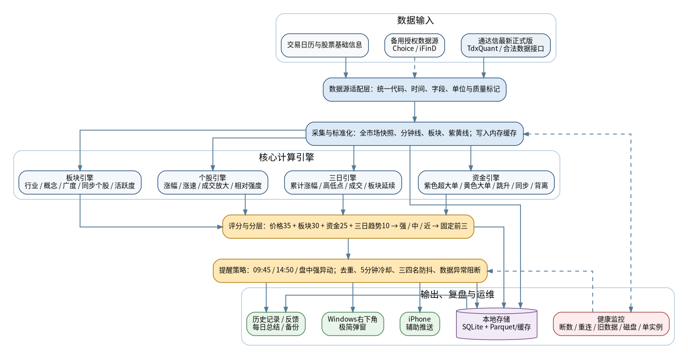
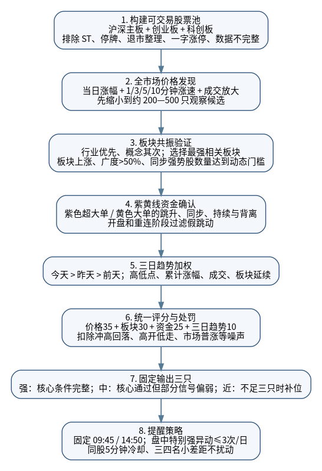
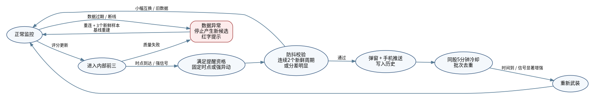
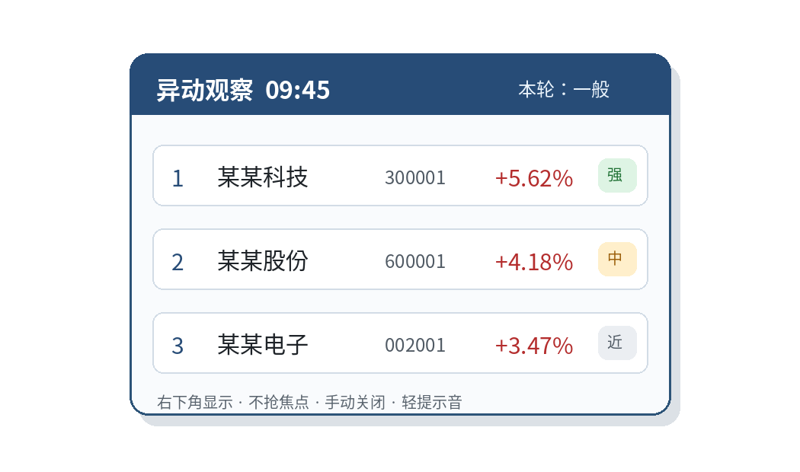

**A股候选观察与异动提醒工具**

**最终开发规格说明书**

Agent Handoff Specification · V2.0

| **文档状态**     | 开发基线：可直接进入 M0 数据可行性验证与 M1 原型开发 |
|------------------|------------------------------------------------------|
| **业务负责人**   | 张新玲                                               |
| **使用范围**     | 公司 / 团队内部，2—3 人，独立 Windows 本地安装       |
| **主数据口径**   | 通达信最新正式版；紫色=超大单，黄色=大单             |
| **默认提醒时间** | 09:45 早盘、14:50 尾盘；09:25 与 10:00 默认关闭      |
| **安全边界**     | 只做候选观察与异动提醒，不读取交易密码，不自动下单   |

<table>
<colgroup>
<col style="width: 100%" />
</colgroup>
<thead>
<tr class="header">
<th>
<strong>一句话任务</strong>

持续扫描沪深主板、创业板和科创板，先从涨幅/涨速发现个股，再用行业或概念板块共振、紫色超大单和黄色大单异动、最近三个交易日趋势进行确认和排序；每轮始终给出三只，使用极简弹窗提醒交易员自行看盘。
</th>
</tr>
</thead>
<tbody>
</tbody>
</table>

编制日期：2026 年 7 月 22 日

后续版本以此文档为基线增量更新，不重写已确认业务规则。

# 文档控制与阅读规则

本文件专门用于把项目交给一个完全没有聊天上下文的开发 Agent、工程师或测试人员。任何实现者应先读完“文档控制、最终锁定需求、M0 数据闸门、评分规则、提醒状态机和验收标准”，再开始写代码。

| **标签**         | **含义**                                             | **开发动作**                                       |
|------------------|------------------------------------------------------|----------------------------------------------------|
| **【锁定】**     | 来自最终确认的业务要求                               | 不得自行修改；如冲突，以“决策与冲突处理”章节为准。 |
| **【工程默认】** | 问卷未给出具体数字，或同一题存在冲突后采用的首版默认 | 做成配置项并记录版本；可在试用后调整。             |
| **【M0 阻塞】**  | 若不通过，将影响完整 V1 的数据可行性                 | 必须先验证；失败时按降级路线执行。                 |
| **【后续】**     | 已经确认需要，但不与核心 V1 同批上线                 | 保留接口与数据结构，不阻塞核心版本。               |

<table>
<colgroup>
<col style="width: 100%" />
</colgroup>
<thead>
<tr class="header">
<th>
<strong>信息优先级</strong>

发生不一致时按以下顺序处理：① 2026-07-22 后续直接确认；② 已填写问卷中更具体、位置更靠后的答案；③ 本文明确写出的冲突处理；④ 工程默认。不得回到泛化的“行业最佳实践”覆盖已确认习惯。
</th>
</tr>
</thead>
<tbody>
</tbody>
</table>

## 版本记录

| **版本** | **日期**   | **状态**     | **主要变化**                                                                      |
|----------|------------|--------------|-----------------------------------------------------------------------------------|
| V1.0     | 2026-07-22 | 需求整理     | 根据回收问卷形成首版最终需求与实施方案。                                          |
| V1.1     | 2026-07-22 | 补充确认     | 确认通达信最新正式版、iPhone、默认时间、案例后补、风险模块后置。                  |
| V2.0     | 2026-07-22 | 本次开发基线 | 补齐架构、接口、数据模型、公式、状态机、测试、部署、降级、验收与 Agent 执行清单。 |

## 目录

| **章节** | **内容**                     |
|----------|------------------------------|
| **1**    | 最终锁定需求                 |
| **2**    | 用户、环境与使用场景         |
| **3**    | 范围、版本和非目标           |
| **4**    | M0 数据可行性闸门            |
| **5**    | 总体技术架构                 |
| **6**    | 交易时段、股票池与数据质量   |
| **7**    | 标准化数据模型与接口契约     |
| **8**    | 个股价格与涨速引擎           |
| **9**    | 行业/概念板块共振引擎        |
| **10**   | 紫色超大单与黄色大单引擎     |
| **11**   | 最近三个交易日趋势引擎       |
| **12**   | 统一评分、强中近与固定前三   |
| **13**   | 提醒策略、去重、防抖与状态机 |
| **14**   | 桌面界面、iPhone 推送和复盘  |
| **15**   | 存储、日志、备份与数据保留   |
| **16**   | 项目结构、配置和伪代码       |
| **17**   | 测试、验收和效果评价         |
| **18**   | 故障、极端行情与墨菲定律     |
| **19**   | AI、自动调整和每日总结       |
| **20**   | 后续风险异动模块             |
| **21**   | 实施阶段与交付物             |
| **22**   | 决策与冲突处理               |
| **23**   | Agent 开发执行清单           |
| **附录** | 配置、接口、数据库与示例     |

# 1. 最终锁定需求

<table>
<colgroup>
<col style="width: 100%" />
</colgroup>
<thead>
<tr class="header">
<th>
<strong>【锁定】产品定位</strong>

本工具是“候选观察名单 / 异动提醒”，不是买入、卖出或收益承诺。交易员看到结果后自行进入通达信或东方财富看盘并决定，不接触交易账户。
</th>
</tr>
</thead>
<tbody>
</tbody>
</table>

## 1.1 核心业务目标

> • 从约数千只 A 股中快速缩小到三只，减少周末逐行业/概念复盘和工作日持续盯盘的时间。
>
> • 尽早发现当日突然走强、涨速加快的个股。
>
> • 确认该个股不是孤立上涨，而是所在行业或概念板块也整体走强。
>
> • 结合通达信中的紫色超大单线和黄色大单线判断资金是否跳升、同步、持续或背离。
>
> • 最近三个交易日作为趋势背景；今天最重要，昨天次之，前天再次。
>
> • 每轮始终给出三只；完全符合不足三只时，用最接近条件的股票补足并明确标记。
>
> • 比“尽量不漏掉”更偏向少打扰；不允许一次弹出几十只。

## 1.2 最终一句话定义

<table>
<colgroup>
<col style="width: 100%" />
</colgroup>
<thead>
<tr class="header">
<th>
<strong>业务定义</strong>

全市场实时观察 → 价格/涨速发现 → 强行业或强概念确认 → 紫黄线资金确认 → 三日趋势加权 → 固定输出三只 → 09:45、14:50 和盘中特别强异动提醒。
</th>
</tr>
</thead>
<tbody>
</tbody>
</table>

## 1.3 不可妥协项

| **编号** | **不可妥协要求**     | **实现含义**                                                        |
|----------|----------------------|---------------------------------------------------------------------|
| **B-01** | 一次只显示三只       | 所有候选在后台排序；用户可见弹窗每批固定三行。                      |
| **B-02** | 个股必须结合板块     | 强/中等级不得只依赖个股单独上涨；价格极强但板块弱只能作为“近”补位。 |
| **B-03** | 通达信为主口径       | 行情、板块、紫黄线优先与通达信最新正式版一致。                      |
| **B-04** | 少打扰               | 无变化不重复、同股五分钟冷却、三四名小差距不反复弹。                |
| **B-05** | 异常时不伪造正常结果 | 数据中断、过期或关键字段缺失时停止产生新候选并红字提示。            |
| **B-06** | 永不自动交易         | 不读取交易密码，不保存账户信息，不调用下单接口。                    |

# 2. 用户、环境与使用场景

## 2.1 目标用户

| **维度**             | **已确认情况**                            | **设计影响**                                     |
|----------------------|-------------------------------------------|--------------------------------------------------|
| **经验**             | 10—20 年 A 股经验；老股民、职业交易员     | 界面用看盘语言，不用“模型置信度”等技术词。       |
| **交易节奏**         | 以隔日 / 1—3 个交易日为主                 | 当天强度与第二天溢价是后续效果评价重点。         |
| **看盘方式**         | 全天持续看盘；涨幅榜/涨速榜、板块、资金线 | 提醒要及时但不能抢焦点或遮挡主看盘软件。         |
| **看到候选后的动作** | 先看分时/日线，再看紫黄线，再看盘口和板块 | 弹窗极简；详细原因在主窗口/详情页。              |
| **最终拍板人**       | 张新玲                                    | 重要规则变更可口头确认，但程序内必须留配置版本。 |

## 2.2 运行环境

> • Windows 台式机，交易时段通常一直开机并联网，可安装新软件。
>
> • 通常使用三块及以上屏幕；弹窗放右下角且不得抢输入焦点。
>
> • 通达信使用项目启动时能够下载到的最新正式版；M0 必须记录准确版本号、安装来源、位数和更新时间。
>
> • 手机为 iPhone；手机提醒是辅助通道，主机关闭时首版不保证仍有提醒。
>
> • 实际使用者 2—3 人；V1 不做账号系统。建议每人独立安装、独立配置，不共享交易账户或密码。

## 2.3 典型使用流程

> 1\. 开盘前启动通达信和本工具，顶部健康状态应为绿色。
>
> 2\. 09:45 收到早盘三只；交易员按名称/代码进入通达信看分时、紫黄线、盘口和板块。
>
> 3\. 盘中若出现特别强的个股—板块—资金共同异动，十秒内收到一批三只；一天最多三批盘中强异动。
>
> 4\. 14:50 收到尾盘三只；早盘出现过的股票可以再次出现并标记“再次出现”。
>
> 5\. 收盘后查看当天弹过的股票、简单标记“好/一般/不好”，系统生成每日总结。
>
> 6\. 试用期逐步积累真实正例和反例，用于调整工程默认阈值。

# 3. 范围、版本和非目标

## 3.1 完整 V1 必须包含

| **模块**       | **必须能力**                                     | **备注**                             |
|----------------|--------------------------------------------------|--------------------------------------|
| **全市场监控** | 沪市主板、深市主板、创业板、科创板               | 北交所首版默认排除。                 |
| **三日数据**   | 最近三个实际交易日，滚动更新                     | 节假日不按自然日。                   |
| **个股引擎**   | 涨幅、1/3/5/10 分钟涨速、成交放大、相对强度      | 多窗口并行，避免要求用户选固定窗口。 |
| **板块引擎**   | 行业优先、概念其次；板块广度、同步个股、活跃度   | 一股多概念时选当时最强概念。         |
| **资金引擎**   | 紫色超大单、黄色大单的跳升、同步、持续、背离     | 必须通过 M0 验证口径。               |
| **排名**       | 固定三只；强/中/近；整体强/一般/偏弱             | 不足三只完整信号时补位。             |
| **提醒**       | 09:45、14:50、盘中强异动，轻提示音               | 盘中强异动最多三批/日。              |
| **桌面界面**   | 右下角极简弹窗、主窗口状态、详情与历史           | 弹窗手动关闭。                       |
| **手机**       | iPhone 辅助推送                                  | 主机运行时由本地程序发出。           |
| **记录与复盘** | 保存一个月、每日备份、好/一般/不好反馈、每日总结 | 不保存交易账号。                     |

## 3.2 分阶段交付

| **阶段**            | **内容**                                                       | **是否阻塞完整 V1** |
|---------------------|----------------------------------------------------------------|---------------------|
| **M0**              | 数据与授权可行性验证；紫黄线、全市场批量、板块、历史三日、重连 | 是                  |
| **M1 Alpha**        | 股票池、个股/板块、固定三只、桌面界面、固定时点、模拟数据      | 否；可先跑          |
| **M2 V1.0**         | 接入紫黄线、盘中强异动、iPhone、历史、反馈、总结、备份         | 完整 V1             |
| **M3 稳定化**       | 回放测试、性能、安装包、自动启动、参数版本、试用迭代           | 上线前必须          |
| **M4 V1.1【后续】** | 涨停封单下降至约三分之二等风险提醒                             | 否                  |
| **M5 V1.2【后续】** | 自动软参数优化、更加完整的原因详情、可选软件跳转               | 否                  |

## 3.3 明确不做

> • 自动买卖、自动下单、仓位管理、读取账户持仓、保存交易密码。
>
> • 新闻、公告、龙虎榜、融资融券、基本面、财务面、长周期 5/10/20 日因子。
>
> • 向客户、群、公众号或直播对外发布候选；当前只供团队内部。
>
> • 首版云端 SaaS、多租户、复杂权限体系。
>
> • 让大语言模型在盘中直接“猜股票”；实时筛选必须是确定性规则与可复现计算。
>
> • 以网页抓取、界面 OCR 或鼠标脚本作为正式生产数据主链路；仅可用于一次性排查。

<table>
<colgroup>
<col style="width: 100%" />
</colgroup>
<thead>
<tr class="header">
<th>
<strong>节假日消息的处理边界</strong>

问卷勾选了“节假日后的第一个交易日需要考虑假期消息”，但首版又明确不需要新闻/公告模块。V1 只能标记“节后首日”，继续使用最近三个实际交易日，不自动解读假期消息；该点不得被实现者擅自扩展成新闻 AI。
</th>
</tr>
</thead>
<tbody>
</tbody>
</table>

# 4. M0 数据可行性闸门

<table>
<colgroup>
<col style="width: 100%" />
</colgroup>
<thead>
<tr class="header">
<th>
<strong>【M0 阻塞】唯一关键问题</strong>

能否从通达信最新正式版或其合法量化接口中，稳定、实时、批量地读取与交易员界面一致的紫色超大单线、黄色大单线，并获取最近三个交易日和板块成分。未验证前，任何“资金共振”结论都只能是占位实现。
</th>
</tr>
</thead>
<tbody>
</tbody>
</table>

## 4.1 首选数据路线

主路线采用通达信最新正式版 + TdxQuant / 通达信提供的合法 Python 或 HTTP 能力。官方文档显示其可提供实时与历史行情、分笔、分类/板块，并支持批量调用通达信公式；但具体紫黄线公式名称、返回字段、授权和刷新频率必须以安装现场为准。

> • 优先通过 SDK / API / 公式接口读取，不通过屏幕颜色识别。
>
> • 若紫黄线属于自定义或券商定制公式，必须取得公式名称、参数、输出变量和数据权限。
>
> • 如果通达信无法给出一致的资金线，第二路线是 Choice / iFinD / 合法 Level-2 数据；此时要重新确认大单、超大单口径。
>
> • 基础历史日线、交易日历可用第二数据源交叉核验，但实时主口径只能有一个。

## 4.2 M0 必做检查

| **编号**  | **检查项** | **操作**                                                                            | **通过标准**             |
|-----------|------------|-------------------------------------------------------------------------------------|--------------------------|
| **M0-01** | 记录环境   | 通达信版本号、下载来源、安装目录、32/64 位、Python/SDK 版本、授权账号类型。         | 记录完整                 |
| **M0-02** | 确定紫黄线 | 在通达信中打开指标页面，确认指标名称、紫/黄输出变量、单位、是否累计值、是否分钟级。 | 可明确映射               |
| **M0-03** | 实时比对   | 任选至少 3 只股票，每 5 秒记录界面值和程序值，连续不少于 30 分钟。                  | 显示精度范围内一致率≥98% |
| **M0-04** | 历史回取   | 读取今天、昨天、前天的分钟/日线及紫黄线历史。                                       | 无缺口或能说明缺口       |
| **M0-05** | 全市场批量 | 获取纳入范围股票列表并批量获取最新价、昨收、成交量额。                              | 完整且单轮满足性能预算   |
| **M0-06** | 板块能力   | 获取行业、概念、板块成分、个股所属板块，核对电力/半导体/光学光电。                  | 与通达信界面一致         |
| **M0-07** | 重连假跳   | 开盘、午后、断网重连、客户端刷新时观察紫黄线是否重置或跳变。                        | 可识别并过滤             |
| **M0-08** | 授权       | 确认团队内部 2—3 人、本地弹窗、历史保存和计算结果展示是否在许可范围内。             | 获得可执行结论           |
| **M0-09** | 连续运行   | 至少一个完整交易时段不崩溃、不持续掉线。                                            | 关键数据新鲜且可恢复     |

## 4.3 性能预算

| **指标**                 | **工程目标**                               | **不通过时的处理**                       |
|--------------------------|--------------------------------------------|------------------------------------------|
| **全市场基础快照新鲜度** | 正常交易时段 ≤ 3 秒                        | 增加批量接口、分片、缓存或更换数据源。   |
| **一次全市场价格筛选**   | ≤ 2 秒                                     | 采用两阶段扫描：全市场基础 + TopN 深度。 |
| **候选深度计算**         | Top 200—500 在 2 秒内完成                  | 只对初筛池计算资金与板块细节。           |
| **强异动端到端延迟**     | 源数据时间戳到弹窗 ≤ 10 秒                 | 记录各阶段延迟，找到瓶颈。               |
| **数据过期阈值**         | 基础行情 \>5 秒、资金/板块 \>15 秒视为异常 | 停止新提醒，显示红色状态。               |

## 4.4 M0 失败的降级路线

> 1\. 若只能读取价格和板块：继续开发 M1 Alpha，但界面明确显示“资金模块未就绪”，不得把替代字段冒充紫黄线。
>
> 2\. 若可调用公式但全市场太慢：采用全市场价格初筛 → Top 300 批量公式 → Top 50 高频更新的分层策略。
>
> 3\. 若只能拿到逐笔/Level-2：与业务负责人重新确认大单、超大单的金额门槛和主动买卖算法，再自行计算。
>
> 4\. 若通达信授权不允许：更换为正式数据供应商；不允许以网页抓取绕过授权。
>
> 5\. 若板块口径无法取得：完整 V1 暂停；板块共振是核心，不得用泛化行业分类静默替换。

# 5. 总体技术架构

*图 1：推荐总体架构。数据源适配层与业务规则隔离，便于在通达信、Choice 或其他合法数据源之间切换。*

## 5.1 推荐技术栈

| **层**           | **推荐**                                           | **选择理由**                                             |
|------------------|----------------------------------------------------|----------------------------------------------------------|
| **语言**         | Python 3.11/3.12，或安装版 TdxQuant 明确支持的版本 | 与通达信量化接口适配；生态成熟。不要盲目追最新版本。     |
| **桌面 UI**      | PySide6                                            | 可做常驻托盘、无边框右下角弹窗、详情窗口；支持 Windows。 |
| **并发**         | multiprocessing + asyncio/线程池                   | 将供应商 SDK 与 UI 隔离；某一层卡顿不冻结弹窗。          |
| **本地数据库**   | SQLite（WAL）                                      | 单机、低运维、适合配置、提醒、反馈和状态。               |
| **分钟数据缓存** | Parquet / DuckDB 可选                              | 三日全市场分钟数据比全塞 SQLite 更省空间。               |
| **配置**         | YAML + Pydantic 校验                               | 核心参数版本化、可回滚；用户只看到少量安全设置。         |
| **打包**         | PyInstaller one-folder + Inno Setup                | 便于携带供应商 DLL，并做 Windows 安装包。                |
| **测试**         | pytest + 回放数据提供器                            | 没有历史案例时仍可做确定性自动测试。                     |

## 5.2 进程与职责

| **进程/模块**           | **职责**                                       | **故障隔离**                    |
|-------------------------|------------------------------------------------|---------------------------------|
| **provider_worker**     | 初始化通达信 SDK、采集数据、标记时间戳和质量   | 崩溃可独立重启，UI 不退出。     |
| **engine_worker**       | 特征、板块、资金、三日、评分、排名、提醒状态机 | 不直接调用 UI；输出结构化事件。 |
| **desktop_app**         | 主窗口、弹窗、托盘、设置、历史、反馈           | 不在 UI 线程做全市场计算。      |
| **notification_worker** | iPhone 推送与重试                              | 推送失败不得阻塞桌面弹窗。      |
| **summary_job**         | 收盘汇总、次日表现更新、自动备份、可选调参     | 只在收盘后运行。                |

## 5.3 两阶段实时扫描

全市场每只股票都做高成本紫黄线和多板块计算可能超过接口限频。推荐采用分层扫描：

> 1\. 基础层：对全部股票每 1—3 秒获取价格、昨收、成交量额，计算当日涨幅和多窗口涨速。
>
> 2\. 初筛层：保留全市场速度/相对强度靠前的 200—500 只，以及处于强板块的股票。
>
> 3\. 深度层：对初筛池读取紫黄线、所属板块和三日特征；Top 50 可更高频更新。
>
> 4\. 排名层：全量候选统一评分；固定时点冻结一个一致快照后输出三只。
>
> 5\. 强异动层：多个个股同板块在短时间内共同进入高分时，合并成一批提醒，不逐股弹出。

# 6. 交易时段、股票池与数据质量

## 6.1 日内调度

| **时间**        | **动作**                                             | **用户可见**                           |
|-----------------|------------------------------------------------------|----------------------------------------|
| **08:55—09:15** | 启动、检查交易日、刷新股票和板块成分、载入前两日数据 | 健康状态；不弹股票。                   |
| **09:15—09:25** | 预热行情；集合竞价数据可选                           | 09:25 预览默认关闭。                   |
| **09:30—09:32** | 连续竞价开始；过滤开盘累计值重置和紫黄线假跳         | 主窗口更新；强提醒默认暂缓到基线稳定。 |
| **09:45**       | 生成早盘正式三只                                     | 右下角弹窗 + iPhone。                  |
| **10:00**       | 可选固定刷新                                         | 默认关闭。                             |
| **09:32—11:30** | 持续监控强异动                                       | 满足条件时提醒。                       |
| **11:30—13:00** | 午休，暂停实时排名触发                               | 显示休市状态，不提醒。                 |
| **13:00—13:01** | 午后重建短期基线                                     | 过滤重连假跳。                         |
| **13:01—14:50** | 持续监控                                             | 强异动提醒。                           |
| **14:50**       | 生成尾盘正式三只                                     | 右下角弹窗 + iPhone。                  |
| **15:00—15:20** | 结算、更新收盘表现、总结、备份                       | 可查看每日总结。                       |

## 6.2 股票池【锁定】

| **项目**                             | **首版规则**               | **类型**                                   |
|--------------------------------------|----------------------------|--------------------------------------------|
| **沪市主板、深市主板**               | 纳入                       | 锁定                                       |
| **创业板、科创板**                   | 纳入                       | 锁定；按本机交易权限决定是否可进最终三只。 |
| **北交所**                           | 默认排除                   | 工程默认；问卷未勾选。                     |
| **ST、\*ST**                         | 排除                       | 锁定                                       |
| **退市整理、停牌**                   | 排除                       | 锁定                                       |
| **一字涨停、无有效成交**             | 排除                       | 锁定                                       |
| **普通涨停但有成交/开板可能**        | 允许参与但标记 limit_up    | 工程默认                                   |
| **连续涨停**                         | 可纳入，但若为一字板仍排除 | 锁定 + 工程解释                            |
| **上市不足 3 个交易日**              | 排除                       | 锁定                                       |
| **复牌首日、除权除息日、数据不完整** | 当日排除                   | 锁定                                       |
| **价格、市值、成交量最低门槛**       | 不设业务硬限制             | 锁定；只做数据有效性检查。                 |
| **ETF、可转债、B 股、指数**          | 不作为候选                 | 锁定                                       |

## 6.3 交易权限

若某市场不在当前使用者权限内，该市场股票仍可用于计算板块广度和板块强度，但不得进入该使用者的三只候选。V1 采用每台安装一个 permissions 配置，不建立用户账号。

## 6.4 数据新鲜度与质量状态

| **状态**          | **条件**                                          | **行为**                                             |
|-------------------|---------------------------------------------------|------------------------------------------------------|
| **绿色 NORMAL**   | 行情、板块、资金均在允许新鲜度内                  | 正常排名与提醒。                                     |
| **黄色 DEGRADED** | 某非核心字段暂缺、延迟增加、手机推送失败          | 桌面继续；界面提示降级；不虚构字段。                 |
| **红色 STOPPED**  | 价格主链路断、紫黄线核心数据过期、交易日/时间异常 | 停止生成新候选；保留上次结果与时间；红字“数据中断”。 |
| **恢复 WARMING**  | 重连后样本不足                                    | 等待 3 个新鲜周期并重建基线，不把旧数据当新异动。    |

# 7. 标准化数据模型与接口契约

供应商字段必须先转换为统一对象，业务引擎不能直接依赖“通达信某个字典键”。这样才能做回放、测试和将来换数据源。所有时间使用 Asia/Shanghai，所有事件同时保存 source_ts（源时间）和 received_ts（本机接收时间）。

## 7.1 核心对象

| **对象**              | **关键字段**                                                                            | **用途**         |
|-----------------------|-----------------------------------------------------------------------------------------|------------------|
| **Instrument**        | code, name, exchange, board, list_date, is_st, is_suspended, permissions                | 证券主数据       |
| **MarketSnapshot**    | code, source_ts, last, prev_close, open, high, low, volume, amount, bid1/ask1, limit_up | 实时行情         |
| **MinuteBar**         | code, trade_date, minute, open/high/low/close, volume, amount                           | 多窗口涨速与回放 |
| **DailyBar**          | code, trade_date, OHLC, volume, amount, adj_flag                                        | 三日趋势         |
| **FundLinePoint**     | code, source_ts, purple_value, yellow_value, unit, cumulative_flag, quality             | 紫黄线           |
| **Sector**            | sector_id, name, type(industry/concept), provider                                       | 板块定义         |
| **SectorMembership**  | sector_id, code, effective_date                                                         | 板块成分         |
| **SectorSnapshot**    | sector_id, source_ts, breadth, active_count, return, amount_ratio, fund_ratio           | 板块实时特征     |
| **CandidateFeatures** | code + price/sector/fund/trend features + penalties + quality                           | 评分输入         |
| **RankedCandidate**   | rank, score, grade, reasons, selected_sector, config_version                            | 排名输出         |
| **AlertBatch**        | batch_id, type, trigger_ts, overall_level, top3, latency_ms                             | 一次可见提醒     |
| **HealthStatus**      | component, state, last_ok_ts, message, metrics                                          | 运行健康         |

## 7.2 数据源接口

**接口示意：实际函数名可以不同，但归一化输出不可缺失。**

<table>
<colgroup>
<col style="width: 100%" />
</colgroup>
<thead>
<tr class="header">
<th>from typing import Protocol, Sequence 
 
class MarketDataProvider(Protocol): 
def initialize(self) -&gt; None: ... 
def close(self) -&gt; None: ... 
def heartbeat(self) -&gt; dict: ... 
def get_instruments(self) -&gt; list[Instrument]: ... 
def get_trading_calendar(self, start: str, end: str) -&gt; list[str]: ... 
def get_snapshots(self, codes: Sequence[str]) -&gt; list[MarketSnapshot]: ... 
def get_minute_bars(self, codes: Sequence[str], trade_dates: Sequence[str]) -&gt; list[MinuteBar]: ... 
def get_daily_bars(self, codes: Sequence[str], count: int) -&gt; list[DailyBar]: ... 
def get_sectors(self) -&gt; list[Sector]: ... 
def get_sector_members(self, sector_ids: Sequence[str]) -&gt; list[SectorMembership]: ... 
def get_stock_sectors(self, codes: Sequence[str]) -&gt; dict[str, list[str]]: ... 
def get_fund_lines(self, codes: Sequence[str]) -&gt; list[FundLinePoint]: ...</th>
</tr>
</thead>
<tbody>
</tbody>
</table>

## 7.3 数据质量规则

> • 股票代码统一为 000001.SZ / 600000.SH / 688000.SH；内部不得混用纯数字、市场前缀和供应商代码。
>
> • 累计成交量、成交额或资金线发生日内回退时，判断是否为重置、复权或数据错误；不能直接算成负跳升。
>
> • 同一 code + source_ts 只处理一次；迟到数据可修正缓存，但不得再次触发提醒。
>
> • 交易所时间与本机时间偏差超过 3 秒时，黄色提示；超过 10 秒时停止强异动提醒。
>
> • 板块成分每天开盘前刷新并保存 effective_date；盘中不因接口临时空结果删除全部成分。
>
> • 资金线单位和是否累计必须在 M0 写入 provider_metadata；单位未知时资金引擎不得启用。

# 8. 个股价格与涨速引擎

<table>
<colgroup>
<col style="width: 100%" />
</colgroup>
<thead>
<tr class="header">
<th>
<strong>业务优先级</strong>

个股涨幅 / 涨速是第一优先。交易员所说“突然涨了”更接近短时间涨速突然加快，而不是只看当日涨幅绝对值。由于用户不固定看 1、3 或 5 分钟，系统必须多窗口并行。
</th>
</tr>
</thead>
<tbody>
</tbody>
</table>

## 8.1 基础变量

<table>
<colgroup>
<col style="width: 100%" />
</colgroup>
<thead>
<tr class="header">
<th>P(t) = 最新成交价 
Cprev = 昨日收盘价 
r_day = P(t) / Cprev - 1 
r_1m = P(t) / P(t-1m) - 1 
r_3m = P(t) / P(t-3m) - 1 
r_5m = P(t) / P(t-5m) - 1 
r_10m = P(t) / P(t-10m) - 1 
accel_1m = r_1m - mean(过去5个完整1分钟收益) 
amount_5m = 最近5分钟成交额 
amount_ratio= amount_5m / 同时段历史基线或今日滚动基线 
rs_market = r_day - 全市场有效股票中位数涨幅 
rs_sector = r_day - 所选板块有效成分中位数涨幅</th>
</tr>
</thead>
<tbody>
</tbody>
</table>

## 8.2 初筛门槛【工程默认】

初筛不是最终入选，只是把数千只缩小到可做深度计算的 200—500 只。采用“绝对最低变化 + 全市场相对排名”的组合，符合问卷“先达到基本标准，再看全市场排名”。

| **条件**         | **初始默认**                                       | **说明**                             |
|------------------|----------------------------------------------------|--------------------------------------|
| **方向**         | r_day \> 0，或最近 60 秒由绿翻红                   | 今天必须正在上涨或明显转强。         |
| **速度绝对底线** | r_1m ≥ 0.30% 或 r_3m ≥ 0.60% 或 r_5m ≥ 1.00%       | 只是首版起点，需试用标定。           |
| **相对排名**     | 任一窗口涨速位于全市场前 10%；强异动前 1—2%        | 适应不同市场波动。                   |
| **成交确认**     | amount_ratio ≥ 1.2，或成交额排名不低于全市场中位数 | 业务要求必须看成交放大；缺失时降级。 |
| **数据质量**     | 最新价格 ≤5 秒，分钟线完整                         | 否则不进初筛。                       |

## 8.3 价格子分：35 分

| **子项**         | **满分** | **计算方式**                                        |
|------------------|----------|-----------------------------------------------------|
| **当日涨幅强度** | 7        | r_day 全市场百分位；不直接按涨幅线性放大。          |
| **多窗口涨速**   | 12       | max(percentile(r_1m), r_3m, r_5m, r_10m)。          |
| **加速度**       | 5        | accel_1m 的横截面百分位与个股日内 robust z-score。  |
| **成交放大**     | 5        | amount_ratio 百分位；无历史同时段时用今日滚动基线。 |
| **相对大盘**     | 3        | rs_market 百分位。                                  |
| **相对板块**     | 3        | rs_sector 百分位。                                  |

## 8.4 价格处罚

| **场景**                 | **默认处罚** | **检测建议**                                           |
|--------------------------|--------------|--------------------------------------------------------|
| **高开后一路走低**       | -10 至 -18   | 开盘涨幅较高但当前距日内高点回撤明显，且短期斜率为负。 |
| **突然拉升后马上回落**   | -15 至 -25   | 60 秒内回吐本轮涨幅的 50% 以上。                       |
| **临近收盘突然一下拉高** | -8 至 -15    | 14:45 后单分钟尖峰且板块/资金未同步。                  |
| **市场普涨带动**         | -5 至 -10    | 全市场上涨比例高，但个股相对强度低于 60% 分位。        |
| **股价涨、紫黄线下降**   | -12          | 资金背离；见资金引擎。                                 |
| **数据延迟或成交无效**   | 直接排除     | 质量状态不是 NORMAL。                                  |

<table>
<colgroup>
<col style="width: 100%" />
</colgroup>
<thead>
<tr class="header">
<th>
<strong>立即算与防假动作的统一处理</strong>

业务要求“立即就算”，因此价格事件可以立即进入内部排名；为避免一秒钟尖峰直接弹窗，用户可见提醒只要求连续两个新鲜扫描周期或分差显著。这是技术防抖，不是要求价格保持 1—5 分钟。
</th>
</tr>
</thead>
<tbody>
</tbody>
</table>

# 9. 行业 / 概念板块共振引擎

<table>
<colgroup>
<col style="width: 100%" />
</colgroup>
<thead>
<tr class="header">
<th>
<strong>【锁定】板块原则</strong>

行业板块优先、概念板块其次。某只股票属于多个概念时，选择当时最强的概念作为依据。个股所在板块不强时，不能标为“强/中”；最多作为“近”补位。
</th>
</tr>
</thead>
<tbody>
</tbody>
</table>

## 9.1 板块实时特征

| **特征**           | **定义**                                           |
|--------------------|----------------------------------------------------|
| **breadth**        | 板块内当前涨幅 \>0 的有效股票数量 / 有效成分数量。 |
| **active_count**   | 短期涨速位于全市场前 10% 且当日上涨的成分数量。    |
| **sector_return**  | 板块指数涨幅；若无可靠指数，使用成分涨幅中位数。   |
| **amount_ratio**   | 板块最近 5 分钟总成交额 / 历史同时段或今日基线。   |
| **fund_ratio**     | 板块内出现紫线或黄线正向异动的成分比例。           |
| **candidate_rank** | 候选股在板块内按涨速、涨幅或资金强度的排名百分位。 |
| **persistence**    | 板块强度在连续新鲜扫描周期中的稳定程度；仅做防抖。 |

## 9.2 板块通过条件【工程默认】

| **等级**     | **条件**                                                                               |
|--------------|----------------------------------------------------------------------------------------|
| **基础通过** | 板块自身上涨；breadth \> 50%；同步明显走强数量达到动态门槛；候选股在板块内排名前 30%。 |
| **强板块**   | breadth ≥ 2/3；同步强股 ≥5（小板块可≥3）；成交活跃度放大；板块内资金异动比例较高。     |
| **不通过**   | 板块多数下跌、只有个股孤立拉升，或板块数据质量异常。                                   |

动态同步数量默认规则：当有效成分少于 10 只时至少 3 只；达到 10 只时至少 5 只；大板块同时要求 active_count / valid_count 不低于 10%。这样同时尊重“至少 5 只”和“按板块比例”两类回答。

## 9.3 行业与概念如何合成

<table>
<colgroup>
<col style="width: 100%" />
</colgroup>
<thead>
<tr class="header">
<th>industry_score = 当前股票所属行业的实时板块分数 
concept_score = 当前股票全部概念中最高的实时板块分数 
 
sector_pass = industry_pass OR best_concept_pass 
sector_score_normalized = 0.60 * max(industry_score, concept_score) \ 
+ 0.40 * industry_score 
 
# 若没有可靠行业数据，则使用 best_concept_score，但标记 source_degraded。 
# 若行业和概念同时强，额外增加小幅共振奖励，但总板块分不超过30。</th>
</tr>
</thead>
<tbody>
</tbody>
</table>

## 9.4 板块子分：30 分

| **子项**               | **满分** | **说明**                               |
|------------------------|----------|----------------------------------------|
| **上涨广度**           | 8        | \>50% 通过；≥2/3 得高分。              |
| **同步强势股数量**     | 6        | 动态门槛及比例。                       |
| **板块自身涨幅**       | 5        | 跨板块百分位。                         |
| **候选在板块内排名**   | 4        | 涨速/涨幅/资金综合。                   |
| **板块成交活跃度**     | 3        | 最近 5 分钟量额相对基线。              |
| **板块内资金共同增强** | 2        | 多只成分紫/黄线正向。                  |
| **持续与稳定**         | 2        | 连续两个新鲜周期，而非一分钟以上等待。 |

## 9.5 三只可来自同一板块

不做强制分散，按总分选前三；三只可以全部来自同一最强板块。同板块内部并列时优先：最早启动的龙头 → 紫色超大单更强 → 紫黄线更同步 → 走势稳定 → 成交活跃 → 年内涨停表现（若未来有可靠字段，首版不强制）。

# 10. 紫色超大单与黄色大单引擎

<table>
<colgroup>
<col style="width: 100%" />
</colgroup>
<thead>
<tr class="header">
<th>
<strong>【锁定】颜色与主口径</strong>

紫色线代表超大单，黄色线代表大单，以通达信为准。关注突然跳升、两条线相近时间同向、持续向上、价格与资金同时上行，以及资金背离。
</th>
</tr>
</thead>
<tbody>
</tbody>
</table>

## 10.1 M0 后必须写入的元数据

| **字段**                        | **必须明确**                         |
|---------------------------------|--------------------------------------|
| **formula_name / page_name**    | 通达信指标或页面的准确名称。         |
| **purple_field / yellow_field** | 公式输出变量；不能只按颜色抓。       |
| **unit**                        | 元、万元、比例、净额或其他。         |
| **cumulative_flag**             | 是否从开盘累计；重连或午后是否重置。 |
| **update_granularity**          | 逐笔、秒级、分钟级或随 K 线刷新。    |
| **history_available**           | 最近三个交易日是否可以回取。         |
| **display_rounding**            | 界面显示精度与程序原值。             |

## 10.2 资金变量

<table>
<colgroup>
<col style="width: 100%" />
</colgroup>
<thead>
<tr class="header">
<th>U(t) = 紫色超大单线原值 
L(t) = 黄色大单线原值 
dU_1m = U(t) - U(t-1m) 
dL_1m = L(t) - L(t-1m) 
zU = robust_zscore(dU_1m, 过去20个有效分钟) 
zL = robust_zscore(dL_1m, 过去20个有效分钟) 
rankU/L = 当次初筛池或全市场的横截面百分位 
slopeU/L = 最近若干新鲜样本的线性斜率 
sync_gap = 两条线最近一次正向跳升事件的时间差</th>
</tr>
</thead>
<tbody>
</tbody>
</table>

## 10.3 跳升与同步【工程默认】

| **事件**     | **初始定义**                                                                   |
|--------------|--------------------------------------------------------------------------------|
| **紫线跳升** | dU_1m \> 0，且 zU ≥2.0 或 rankU ≥95%，同时超过 M0 识别出的噪声底线。           |
| **黄线跳升** | dL_1m \> 0，且 zL ≥2.0 或 rankL ≥95%，同时超过噪声底线。                       |
| **同步向上** | 紫、黄正向事件几乎同时或 60 秒内发生；问卷同时勾选“几乎同一时刻”和“1 分钟内”。 |
| **持续向上** | 最近 3 个新鲜样本中至少 2 个斜率为正；用于增强，不延迟首次内部事件。           |
| **资金领先** | 资金正向事件发生后，价格在 60—180 秒内转强；只做加分。                         |
| **资金背离** | 价格上涨但紫、黄线均下降或快速转弱；明显降分。                                 |
| **方向冲突** | 一条向上、一条向下；进入观察 120 秒，不触发盘中强提醒。                        |

## 10.4 资金子分：25 分

| **子项**            | **满分** | **说明**                                      |
|---------------------|----------|-----------------------------------------------|
| **紫色超大单**      | 7        | 业务优先级高于黄色。                          |
| **黄色大单**        | 5        | 独立强时也可形成资金证据。                    |
| **紫黄同步**        | 6        | 60 秒内共同上行。                             |
| **持续性**          | 3        | 多个新鲜样本方向一致。                        |
| **与价格同时/领先** | 2        | 价格与资金共同上行或资金先动。                |
| **翻正/交叉**       | 2        | M0 确认公式含义后启用；未确认前只记录不加分。 |

## 10.5 单线强、双线强和背离

> • 紫线明显上升、黄线不动：仍可视为有效资金证据；若价格和板块也强，可进入“中”，极强时可为“强”。
>
> • 黄线明显上升、紫线不动：同样可视为有效资金证据，但同等条件下紫线优先。
>
> • 双线同步上升：完整资金共振，获得同步分。
>
> • 资金向上但价格未涨：进入后台观察，排名不高，不触发强异动弹窗。
>
> • 价格上涨但资金转弱：明显降分，严重时从强/中降为近。

## 10.6 开盘和重连假跳过滤

> 1\. 09:30 开盘后先判断供应商字段是否从零重置或补发累计数据；未稳定前不触发资金强提醒。
>
> 2\. 13:00、网络重连、通达信重启后进入 WARMING；至少 3 个新鲜样本并持续 30 秒后恢复。
>
> 3\. 若源时间戳没有前进、一次返回多分钟历史或累计值回退，全部标记为 replay/reset，不触发。
>
> 4\. 假跳过滤只阻止用户可见提醒；原始样本和原因应记录供排查。

# 11. 最近三个交易日趋势引擎

<table>
<colgroup>
<col style="width: 100%" />
</colgroup>
<thead>
<tr class="header">
<th>
<strong>【锁定】时间权重</strong>

每天滚动使用最近三个实际交易日；今天最重要，昨天次之，前天再次。前两天弱但今天出现个股+资金+板块共同走强，可以进前三；前两天强但今天明显走弱，不进入强/中。
</th>
</tr>
</thead>
<tbody>
</tbody>
</table>

## 11.1 特征

| **特征**         | **定义/实现**                                                    |
|------------------|------------------------------------------------------------------|
| **三日累计涨幅** | 从三日窗口起点前一收盘到当前价的累计收益；需要额外一个锚点收盘。 |
| **低点抬高**     | 前天低点 \< 昨天低点 \< 今天盘中低点；缺一项则部分得分。         |
| **高点提高**     | 前天高点 \< 昨天高点 \< 今天盘中高点。                           |
| **成交逐日放大** | 三日成交额或截至同一盘中时刻的成交额呈上升。                     |
| **资金逐日增强** | 若紫黄线有历史且口径一致，则按日末或同时段比较。                 |
| **板块连续活跃** | 股票所属行业或最强概念最近三日中至少两日位于活跃板块。           |
| **今日延续**     | 今天当前价格/资金/板块不能明显走弱；这是强/中硬条件。            |

## 11.2 权重与子分：10 分

三日引擎只做背景加权，不得盖过今天的盘中信号。建议特征中的日权重为：今天 0.60、昨天 0.25、前天 0.15。

| **子项**                  | **满分** |
|---------------------------|----------|
| **三日累计涨幅**          | 2        |
| **低点抬高**              | 2        |
| **高点提高**              | 2        |
| **成交逐日放大**          | 2        |
| **板块连续活跃/资金增强** | 2        |

## 11.3 特殊日

> • 上市不足三个交易日：排除。
>
> • 停牌复牌、除权除息导致机械跳变：当日排除。
>
> • 节后首日：仍取最近三个实际交易日；界面可标“节后首日”，不解读假期消息。
>
> • 历史数据缺一日：数据质量红色，完整 V1 不产生新候选。

# 12. 统一评分、强/中/近与固定前三

*图 2：候选筛选与排名流水线。*

## 12.1 总分

<table>
<colgroup>
<col style="width: 100%" />
</colgroup>
<thead>
<tr class="header">
<th>raw_score = price_score(0..35) \ 
+ sector_score(0..30) \ 
+ fund_score(0..25) \ 
+ trend_score(0..10) 
 
final_score = clamp(raw_score - penalties, 0, 100)</th>
</tr>
</thead>
<tbody>
</tbody>
</table>

权重来自问卷明确排序：个股涨幅/涨速第一，板块第二，紫色超大单第三，黄色大单第四；三日趋势作为加分。具体子项数字属于工程默认，必须写入 config_version。

## 12.2 分层

| **等级** | **默认条件**                                                                    | **弹窗含义**                         |
|----------|---------------------------------------------------------------------------------|--------------------------------------|
| **强**   | final_score ≥80；价格门、板块门通过；有有效资金证据；无严重回落/数据问题        | 当前最符合目标结构，不代表一定上涨。 |
| **中**   | final_score ≥65；价格和板块通过；资金为单线强或双线中等，或价格极强且无明显背离 | 核心结构基本成立，仍需人工确认。     |
| **近**   | 未满足强/中，但在当前有效股票中综合最接近；用于补足三只                         | 明确表示只是接近，不得当作同等强度。 |

## 12.3 固定三只的选取算法

> 1\. 先排除无效股票、交易权限不符股票和红色数据。
>
> 2\. 从满足“价格 + 板块”的 qualified 集合按 final_score 降序选取。
>
> 3\. 再从有价格/板块/资金任一强事件的 observed 集合补足，标为“近”。
>
> 4\. 若仍不足三只，从当日相对强度最高、数据完整的股票补足，仍标“近”，并将整轮标为“整体偏弱”。
>
> 5\. 若核心数据源处于红色 STOPPED，则不强行给三只；只显示“数据中断”和上次结果时间。数据异常优先于“始终三只”。

## 12.4 价格强但板块弱的冲突处理

<table>
<colgroup>
<col style="width: 100%" />
</colgroup>
<thead>
<tr class="header">
<th>
<strong>最终统一规则</strong>

价格很强的股票可以进入后台观察池，但只有板块通过才能成为“强/中”。板块不配合时只能在完整信号不足三只的情况下以“近”补位。这样同时尊重“价格最重要”和“板块不强就放弃”两类回答。
</th>
</tr>
</thead>
<tbody>
</tbody>
</table>

## 12.5 并列与排序

分数相同或差距小于 0.5 分时，依次比较：板块更强 → 涨速更快 → 紫色超大单更强 → 成交更活跃 → 信号更早。默认不做板块分散。优先名单若启用，只在最后并列时加 0—1 分，不能突破排除项或硬门。

## 12.6 本轮整体等级

| **整体等级**     | **默认判断**                                         |
|------------------|------------------------------------------------------|
| **强**           | 至少 2 只为“强”，且第一名 ≥85。                      |
| **一般**         | 至少 1 只“强”或至少 2 只“中”。                       |
| **整体偏弱**     | “近”达到 2 只及以上，或没有 qualified 股票。         |
| **市场整体偏弱** | 同时参考全市场上涨比例 \<35%；可与整体等级并列显示。 |

# 13. 提醒策略、去重、防抖与状态机

*图 3：提醒状态机。内部排名可以立即变化，但用户可见提醒必须经过新鲜度、去重和防抖。*

## 13.1 固定提醒

| **时间**  | **规则**                                         |
|-----------|--------------------------------------------------|
| **09:45** | 早盘正式结果；冻结一致快照，输出三只。           |
| **14:50** | 尾盘正式结果；早盘股票可再次出现并标“再次出现”。 |
| **09:25** | 集合竞价预览，默认关闭；不要求紫黄线完整。       |
| **10:00** | 可选早盘确认刷新，默认关闭。                     |

## 13.2 盘中特别强异动

盘中强异动不是每次前三变化都弹，而是个股、板块、资金同时达到高强度。初始工程条件：

> • 至少一只新候选为“强”，final_score ≥82。
>
> • 短期涨速至少位于全市场前 1—2%。
>
> • 所属行业或最强概念达到“强板块”。
>
> • 存在双线同步或一条资金线极强且没有背离。
>
> • 该股票为新进入前三，或相对上次提醒分数提高 ≥8 分。
>
> • 从源事件时间到桌面弹窗不超过 10 秒。

## 13.3 频率和防打扰【锁定】

| **规则**           | **默认实现**                                                           |
|--------------------|------------------------------------------------------------------------|
| **盘中强异动次数** | 最多 3 批/交易日；固定 09:45 与 14:50 不计入该上限。                   |
| **同一股票冷却**   | 至少 5 分钟；若分数显著增强可在冷却后再次出现。                        |
| **同一三只不重复** | 短时间内集合和顺序均不变时不弹；固定早盘/尾盘跨时段可再次出现。        |
| **三四名小差距**   | 主窗口内部立即更新；只有替代者高出至少 3 分或连续 2 个新鲜周期时才弹。 |
| **一批合并**       | 同一板块多个个股同时异动，合并成一批三只，不逐股连弹。                 |
| **午休/收盘**      | 不触发。                                                               |
| **声音**           | 轻提示音；首版无需用户开关。                                           |

## 13.4 固定时点与“无变化不重复”的统一

09:45 和 14:50 都必须生成并保存一个 scheduled_result。若与最近五分钟的可见批次完全相同，不重复弹；早盘到尾盘相隔较久，允许再次弹并标“再次出现”。因此既保留两个固定时点，又避免短时间重复。

## 13.5 通知事件伪代码

<table>
<colgroup>
<col style="width: 100%" />
</colgroup>
<thead>
<tr class="header">
<th>def maybe_emit_alert(trigger, ranked_top3, health, now): 
if health.state == "STOPPED": 
show_data_interruption() 
return 
 
batch = build_batch(trigger, ranked_top3, now) 
if trigger == "intraday": 
if intraday_count_today &gt;= 3: 
return 
if not batch.has_strong_joint_signal: 
return 
 
if same_batch_within_window(batch, minutes=5): 
return 
if all_items_in_cooldown(batch, minutes=5): 
return 
if small_rank_swap_only(batch, min_margin=3.0, required_cycles=2): 
return 
 
persist(batch) 
desktop_popup(batch) 
send_phone_async(batch)</th>
</tr>
</thead>
<tbody>
</tbody>
</table>

# 14. 桌面界面、iPhone 推送和复盘

## 14.1 弹窗规格【锁定】

*图 4：弹窗示意。真实股票仅作占位；弹窗不显示长解释。*

| **项目**     | **规格**                                                     |
|--------------|--------------------------------------------------------------|
| **位置**     | 主屏幕右下角；不抢焦点；若多屏可在设置中选择屏幕。           |
| **停留**     | 一直保留，手动关闭。                                         |
| **一批数量** | 同一窗口三行。                                               |
| **每行字段** | 股票名称、代码、当前涨幅、强/中/近。                         |
| **标题**     | “异动观察 + 时间 + 本轮强/一般/整体偏弱”。                   |
| **声音**     | 轻提示音一次。                                               |
| **当前价格** | 不占弹窗字段；在主窗口/详情中显示。                          |
| **操作**     | 单击行复制代码或打开详情；通达信跳转为可选功能，默认不依赖。 |
| **再次出现** | 早盘股票尾盘再次入选时，在详情/小标识注明。                  |

## 14.2 主窗口

> • 顶部健康条：数据正常/降级/中断、最后更新时间、通达信连接状态、当前交易阶段。
>
> • 当前前三：名称、代码、涨幅、价格、等级、总分、所选板块、简短原因。
>
> • Top 20 候选表：供开发和试用观察，默认折叠，避免干扰交易员。
>
> • 板块异动：展示当前最强行业/概念及同步强股数量。
>
> • 历史：保存一个月的固定与盘中提醒。
>
> • 反馈：每批或每只标“好/一般/不好”；可每天简单沟通、每周集中复盘。
>
> • 设置：提醒时间、iPhone 推送、优先名单、暂停/恢复；核心阈值不直接暴露给普通用户。

## 14.3 详情页

详情页可以信息较多，但必须使用股票语言，建议包含：

> • 个股：当日涨幅、1/3/5/10 分钟涨速、成交放大、相对市场、相对板块。
>
> • 板块：行业、最强概念、上涨比例、同步强势股数量、板块内排名。
>
> • 资金：紫色超大单、黄色大单当前值、1 分钟变化、是否同步/背离。
>
> • 三日：累计涨幅、高低点、成交趋势、板块连续活跃。
>
> • 总分、处罚项、数据时间、配置版本和入选原因。

## 14.4 iPhone 辅助推送

推荐首版实现可替换的 NotificationChannel，默认支持 Bark（HTTP 调用即可把自定义通知推送到 iPhone，且可自建服务）；如现场网络或 App 安装不适合，再切换 PushDeer 或团队已有消息渠道。手机推送不是核心计算依赖。

| **项目**     | **规则**                                                                     |
|--------------|------------------------------------------------------------------------------|
| **触发**     | 与桌面可见批次一致；桌面先发，手机异步。                                     |
| **内容**     | 标题 + 三行“名称 代码 涨幅 等级”；不发送详细特征。                           |
| **失败**     | 超时 3 秒，重试 1 次；记录失败，不阻塞桌面。                                 |
| **主机关机** | 不保证推送；符合用户确认。                                                   |
| **密钥**     | Bark device key 等存入 Windows Credential Manager 或受限配置，不写普通日志。 |

## 14.5 历史、导出和总结

> • 历史入口保存固定提醒、盘中提醒、被抑制的强候选摘要和数据中断事件，用户默认只看可见批次。
>
> • 每天自动生成 CSV/JSON 备份的候选名单，满足“导出每日候选”，不要求用户手工打开 Excel。
>
> • 15:10 生成当日总结：弹过哪些三只、收盘表现、最常出现板块、用户反馈。
>
> • 第二个交易日收盘后补写次日表现；用户更关注长期统计和次日溢价。

# 15. 存储、日志、备份与数据保留

## 15.1 保留策略

| **数据**               | **保留**            | **说明**                                     |
|------------------------|---------------------|----------------------------------------------|
| **提醒批次与三只明细** | 1 个月              | 用户可查询；包含分数、等级、板块、简短原因。 |
| **反馈与每日总结**     | 至少 1 年或手工清理 | 用于长期统计；体积很小。                     |
| **全市场分钟线缓存**   | 最近 4 个交易日     | 三日计算需一个锚点；每日滚动清理。           |
| **TopN 特征样本**      | 7—30 天             | 用于排错和回放；不保存全市场逐秒原始数据。   |
| **健康/错误日志**      | 30 天，滚动压缩     | 不含交易密码。                               |
| **每日备份**           | 30 份               | 加密或压缩保存至本机独立目录。               |

## 15.2 SQLite 表

| **表**                | **用途**                   | **主键/索引**                     |
|-----------------------|----------------------------|-----------------------------------|
| **instruments**       | 股票主数据与排除标记       | code                              |
| **sectors**           | 板块定义                   | sector_id                         |
| **sector_membership** | 板块成分及生效日           | sector_id + code + effective_date |
| **alerts**            | 批次级提醒                 | batch_id                          |
| **alert_items**       | 每批三只、分数、等级、原因 | batch_id + rank                   |
| **feedback**          | 好/一般/不好               | feedback_id                       |
| **candidate_events**  | TopN/强事件摘要            | event_id                          |
| **config_versions**   | 参数版本与变更原因         | version_id                        |
| **health_events**     | 断数、重连、延迟、推送失败 | event_id                          |
| **daily_summaries**   | 收盘与次日表现             | trade_date                        |
| **priority_list**     | 可选自选优先名单           | code                              |
| **risk_watchlist**    | 后续风险提醒关注名单       | code                              |

## 15.3 必须记录的每次提醒上下文

> • 触发类型、源事件时间、弹窗时间、端到端延迟。
>
> • 三只股票的名称、代码、价格、涨幅、强/中/近、总分、排名。
>
> • 价格/板块/资金/三日子分及处罚项。
>
> • 选中的行业/概念、板块广度和同步个股数。
>
> • 紫黄线原值、变化、单位、同步状态和质量标记。
>
> • 数据源版本、配置版本、应用版本、健康状态。
>
> • 是否成功桌面显示、手机推送是否成功。

## 15.4 备份与恢复

> 1\. 每天 15:20 关闭写事务后复制 SQLite 快照并压缩；分钟缓存写独立日期分区。
>
> 2\. 启动时检查数据库完整性；损坏时切换到最近备份，并在界面红字提示。
>
> 3\. 磁盘可用空间低于 2GB 时黄色提示，低于 500MB 时停止新增历史但保持实时计算。
>
> 4\. 备份目录不得与临时缓存同盘唯一副本；至少支持用户指定第二目录。

# 16. 项目结构、配置和伪代码

## 16.1 推荐仓库结构

<table>
<colgroup>
<col style="width: 100%" />
</colgroup>
<thead>
<tr class="header">
<th>stock-alert/ 
README.md 
pyproject.toml 
config/ 
default.yaml 
user.yaml 
src/stock_alert/ 
app.py 
domain/models.py 
providers/base.py 
providers/tdx.py 
providers/replay.py 
engine/universe.py 
engine/price.py 
engine/sector.py 
engine/fund.py 
engine/trend3d.py 
engine/ranking.py 
engine/alert_policy.py 
storage/db.py 
storage/repository.py 
ui/main_window.py 
ui/popup.py 
notifications/base.py 
notifications/bark.py 
jobs/daily_summary.py 
jobs/backup.py 
health/watchdog.py 
tools/m0_probe.py 
tools/replay_day.py 
tests/ 
unit/ 
integration/ 
replay/ 
installer/ 
docs/ 
M0_report.md 
runbook.md 
change_log.md</th>
</tr>
</thead>
<tbody>
</tbody>
</table>

## 16.2 配置分层

| **层**           | **谁能改**           | **示例**                                     |
|------------------|----------------------|----------------------------------------------|
| **锁定业务规则** | 开发方；需负责人确认 | 固定三只、排除 ST、无自动交易、板块门。      |
| **软参数**       | 自动调参/开发方      | 权重、百分位、绝对涨速底线、分差。           |
| **用户设置**     | 交易员               | 提醒时间、iPhone 开关、优先名单、暂停/恢复。 |
| **运行环境**     | 安装人员             | 通达信路径、SDK 路径、日志目录、设备密钥。   |

## 16.3 主循环伪代码

<table>
<colgroup>
<col style="width: 100%" />
</colgroup>
<thead>
<tr class="header">
<th>while trading_session_active(): 
snapshots = provider.get_snapshots(all_codes) 
health.update(snapshots) 
if health.stopped: 
publish_health_only() 
continue 
 
price_features = price_engine.update(snapshots, minute_cache) 
shortlist = select_price_shortlist(price_features, target=300) 
 
fund_points = provider.get_fund_lines(shortlist) 
sector_inputs = sector_cache.expand_for(shortlist) 
sector_features = sector_engine.compute(sector_inputs, snapshots, fund_points) 
trend_features = trend_engine.compute(shortlist, daily_cache, minute_cache) 
fund_features = fund_engine.compute(fund_points, reconnect_state) 
 
candidates = feature_join(price_features, sector_features, fund_features, trend_features) 
ranked = ranking_engine.rank(candidates, universe_rules, config) 
state.publish_top3(ranked[:3]) 
 
trigger = scheduler_or_intraday_trigger(ranked, now) 
alert_policy.maybe_emit(trigger, ranked[:3], health, now)</th>
</tr>
</thead>
<tbody>
</tbody>
</table>

## 16.4 单实例与启动

> • 使用 Windows mutex 或文件锁，避免同机启动两个实例造成重复提醒。
>
> • 启动顺序：锁 → 日志 → 配置校验 → 数据库 → provider → 历史缓存 → UI → 调度。
>
> • 通达信未启动时显示“等待通达信”，每 15 秒重试；不得无限弹错误框。
>
> • 退出时先停止新调度、保存状态、关闭 provider、完成数据库提交。
>
> • 可选“开机自动启动”，但首次安装默认由用户手动确认。

# 17. 测试、验收和效果评价

## 17.1 无历史案例时的测试策略

现阶段没有可立即提供的正反历史案例，因此不能把“等案例”作为开工前置条件。必须同时建设 ReplayProvider 和 SyntheticScenarioBuilder，用固定 CSV/Parquet 输入模拟价格、板块、紫黄线、断网和重连。真实案例在试用中逐步替换。

## 17.2 单元测试清单

| **编号**  | **模块**   | **验证点**                                           |
|-----------|------------|------------------------------------------------------|
| **UT-01** | 股票池     | ST、停牌、退市、一字涨停、\<3 日、除权复牌正确排除。 |
| **UT-02** | 多窗口收益 | 1/3/5/10 分钟边界、午休跨越、缺失分钟。              |
| **UT-03** | 价格百分位 | 并列、极端值、全市场样本不足。                       |
| **UT-04** | 板块广度   | 小板块、大板块、无效成分、成分重复。                 |
| **UT-05** | 多概念选择 | 正确选择当时最强概念，行业仍有优先权。               |
| **UT-06** | 资金跳升   | 累计值、分钟差、z-score、横截面排名。                |
| **UT-07** | 资金同步   | 同一时刻、60 秒内、超过 60 秒、方向冲突。            |
| **UT-08** | 三日趋势   | 高低点、累计涨幅、今天反转、节假日。                 |
| **UT-09** | 强中近     | 阈值边界、资金缺失、板块不通过补位。                 |
| **UT-10** | 固定三只   | 0/1/2/3+ 完整信号均输出正确。                        |
| **UT-11** | 去重冷却   | 五分钟、相同批次、三四名小差、尾盘再次出现。         |
| **UT-12** | 数据中断   | 停止新候选、恢复预热、旧数据不重复。                 |

## 17.3 集成与回放场景

| **场景**                                      | **预期**                                      |
|-----------------------------------------------|-----------------------------------------------|
| **同板块 6 只在 60 秒内共同加速，紫黄线同步** | 合并成一批，三只为该板块高分股；十秒内提醒。  |
| **单股涨 8%，板块仅 30% 上涨**                | 不能标强/中；最多近。                         |
| **个股涨 4%，板块 75% 上涨，资金同步**        | 优先级高。                                    |
| **紫线强、黄线不动，价格和板块强**            | 有效资金证据；至少中。                        |
| **黄线强、紫线下行**                          | 观察，不触发强提醒。                          |
| **开盘资金累计值一次性跳变**                  | WARMING 过滤，不弹。                          |
| **第三/第四名每秒互换 0.5 分**                | 主窗口可变化，弹窗不抖。                      |
| **网络中断 20 秒后恢复**                      | 红字停更；恢复后 3 个样本预热；不补发旧提醒。 |
| **固定时点没有完整信号**                      | 仍输出三只，含近，顶部“整体偏弱”。            |
| **核心数据缺失**                              | 不输出伪三只，只显示数据中断。                |

## 17.4 功能验收

> 1\. 能够稳定获取纳入范围内的全市场股票，排除项准确。
>
> 2\. 价格、分钟线、板块和紫黄线数据在 M0 规定误差与时效内。
>
> 3\. 09:45 与 14:50 自动生成结果；盘中强异动端到端 ≤10 秒。
>
> 4\. 三只固定显示，强/中/近正确；整体弱有明确提示。
>
> 5\. 同股 5 分钟冷却；小幅三四名互换不反复弹；盘中最多 3 批。
>
> 6\. 右下角弹窗不抢焦点，手动关闭，轻提示音，iPhone 可收到镜像。
>
> 7\. 断网、数据过期、重启时有明确状态，不把旧数据当新异动。
>
> 8\. 历史一个月、每日备份、反馈与每日总结可用。
>
> 9\. 程序不读取交易密码、不调用下单接口。
>
> 10\. 安装包可在目标 Windows 电脑重复安装、启动和卸载。

## 17.5 效果评价

首版验收以功能稳定为主，不承诺命中率。试用后按长期统计评价，不以单次成败判断。建议记录：

> • 提醒价到当日收盘的收益；相对全市场中位数或板块中位数的超额收益。
>
> • 第二天开盘、最高、收盘相对提醒价的表现。
>
> • 每批三只中至少一只继续上涨、两只以上表现较好、三只平均表现。
>
> • 用户“好/一般/不好”比例。
>
> • 每天提醒批数、重复抑制次数、数据中断时间和平均延迟。
>
> • 不同市场环境：上涨、下跌、震荡、题材轮动、低迷、极端波动。

<table>
<colgroup>
<col style="width: 100%" />
</colgroup>
<thead>
<tr class="header">
<th>
<strong>禁止后视偏差</strong>

历史回放必须使用当时可获得的数据和当时的板块成分；不能用未来收盘价筛选、不能用事后最低价作为买入价、不能在回放中读取未来三日信息。
</th>
</tr>
</thead>
<tbody>
</tbody>
</table>

# 18. 故障、极端行情与墨菲定律

| **风险**                    | **默认处理**                                                   |
|-----------------------------|----------------------------------------------------------------|
| **通达信升级后字段变化**    | 启动自检失败，模块红色；不静默使用旧字段；记录版本并回滚。     |
| **通达信未启动/未登录行情** | 等待并每 15 秒重试；主窗口提示，不连续弹错误。                 |
| **网络中断**                | STOPPED；停止新候选；恢复后预热，不补发旧提醒。                |
| **本机休眠/时间跳变**       | 检测时间差；重建短窗口，不把休眠前后差值当涨速。               |
| **源时间戳重复/倒退**       | 去重并标记 stale/reset。                                       |
| **午后重连**                | 30 秒 + 3 个新鲜样本 WARMING。                                 |
| **开盘资金假跳**            | 识别累计值重置；09:30—09:32 默认不做资金强提醒。               |
| **大盘普涨**                | 比较相对市场和板块，避免所有股票同涨造成假强。                 |
| **大盘普跌**                | 仍可给相对最强三只，但顶部“市场整体偏弱”。                     |
| **指数/板块瞬间消息拉升**   | 内部立即记录；用户提醒需两个新鲜周期或分差明显。               |
| **涨停/跌停无成交**         | 一字涨停排除；普通涨停标记；跌停不进上涨候选。                 |
| **除权、复牌、新股**        | 当日排除，不将机械跳变计入涨幅。                               |
| **板块成分接口临时空**      | 保留最近成功快照并标黄；超过阈值转红。                         |
| **大板块成员过多**          | 按比例、中位数和百分位，不只按上涨数量。                       |
| **重复启动两个实例**        | 单实例锁，第二实例唤醒已有窗口。                               |
| **数据库锁/损坏**           | WAL + 短事务；失败切换备份或只读模式，实时提醒不被长查询阻塞。 |
| **磁盘满**                  | 先停历史写入并告警；不让应用崩溃。                             |
| **iPhone 推送失败**         | 桌面继续；异步重试一次；健康状态黄色。                         |
| **盘中信号洪水**            | 合并批次、日上限、冷却、分差门槛。                             |
| **自动调参变差**            | 配置版本、上限、影子验证、自动回滚。                           |
| **第三方数据授权变化**      | 功能开关关闭；不得继续违规抓取。                               |

## 18.1 健康监控指标

> • provider_last_source_ts、provider_last_received_ts、staleness_seconds。
>
> • full_scan_duration_ms、deep_scan_duration_ms、ranking_duration_ms、alert_latency_ms。
>
> • universe_count、shortlist_count、valid_fund_count、valid_sector_count。
>
> • reconnect_count、duplicate_count、reset_count、suppressed_alert_count。
>
> • database_size、disk_free、backup_last_success、phone_last_success。

# 19. AI、自动调整和每日总结

<table>
<colgroup>
<col style="width: 100%" />
</colgroup>
<thead>
<tr class="header">
<th>
<strong>核心原则</strong>

实时选股不依赖大语言模型。AI 的价值是收盘总结、历史验证整理和软参数优化；所有实时结果必须能用数据和规则复现。
</th>
</tr>
</thead>
<tbody>
</tbody>
</table>

## 19.1 每日总结

> • 模板化输出：当天共几批、各批三只、收盘表现、最常出现板块、数据中断。
>
> • 根据用户反馈总结“好/一般/不好”，不生成买卖建议。
>
> • 次日收盘后补写次日表现，供长期统计。
>
> • 可选 LLM 只读取本地摘要字段；未经许可不上传完整行情或内部名单。

## 19.2 自动调整的安全实现

问卷选择“完全自动调整”，同时又要求核心规则由开发方维护。统一为：系统可自动调整软权重和非关键阈值，但不能自动改变硬规则。

| **可自动调整**                               | **绝对不能自动调整**       |
|----------------------------------------------|----------------------------|
| **价格/板块/资金/三日权重在规定范围内微调**  | 固定三只                   |
| **百分位阈值、绝对涨速底线、分差、防抖周期** | ST/停牌/退市/一字板排除    |
| **强/中分数线小幅调整**                      | 不自动下单、不接触账户     |
| **强异动分数提升门槛**                       | 09:45/14:50 除非用户改设置 |
| **优先名单并列加分**                         | 板块共振的业务定位         |

## 19.3 自动调参启用条件【工程默认】

> 1\. 至少积累 20 个交易日或 100 个可见提醒批次，且反馈/结果数据完整。
>
> 2\. 只在收盘后运行；盘中配置绝不漂移。
>
> 3\. 采用走步验证或时间顺序训练/验证，禁止随机打乱造成未来泄漏。
>
> 4\. 每次权重变化不超过原值 ±10%，阈值变化不超过 2 个百分点。
>
> 5\. 新配置先影子运行 5 个交易日；只有长期指标改善且提醒量未失控才自动切换。
>
> 6\. 保留最近 10 个配置版本；任何异常自动回滚到最近稳定版。

## 19.4 优化目标

下列权重是工程默认，仅用于自动优化框架；在样本不足时不得宣称有效。

<table>
<colgroup>
<col style="width: 100%" />
</colgroup>
<thead>
<tr class="header">
<th>objective = 0.35 * 用户反馈得分 
+ 0.25 * 次日收盘相对收益 
+ 0.15 * 次日最高相对收益 
+ 0.15 * 当日收盘相对收益 
+ 0.10 * 稳定性得分 
- 提醒过多处罚 
- 数据异常/高回撤处罚</th>
</tr>
</thead>
<tbody>
</tbody>
</table>

# 20. 后续风险异动模块：涨停封单快速下降

<table>
<colgroup>
<col style="width: 100%" />
</colgroup>
<thead>
<tr class="header">
<th>
<strong>【后续】上线顺序</strong>

该需求已经确认保留，但不与核心 V1 同批上线。核心候选稳定后作为首个增强模块；独立弹窗，不占用上涨候选的三只位置。
</th>
</tr>
</thead>
<tbody>
</tbody>
</table>

## 20.1 业务场景

持仓或关注股票涨停后，封单额快速下降到封板后参考值的大约三分之二时提醒。该功能需要盘口/Level-2 或可靠买一封单额；若数据源没有，不得用成交量替代。

## 20.2 建议首版规则【工程默认】

> 1\. 用户通过界面手工维护风险关注名单；后续可导入通达信自选。
>
> 2\. 股票触及涨停且买一价等于涨停价，连续 15 秒视为“稳定封板”。
>
> 3\. 参考封单额 baseline = 稳定封板后前 60 秒内的封单额峰值；后续封板期间若出现更高峰值可更新。
>
> 4\. current_seal ≤ 2/3 × baseline，且 30 秒内下降幅度明显时触发。
>
> 5\. 每个封板 episode 只提醒一次；开板后重新封板可建立新 episode。
>
> 6\. 风险提醒单独使用红/橙色窗口和不同声音，不与三只上涨候选合并。

## 20.3 待后续确认

> • 持仓/关注名单由手工录入、通达信自选还是券商导入。
>
> • 封单额单位和 Level-2 权限。
>
> • 三分之二以第一次稳定封板值、峰值还是用户指定值为基准。
>
> • 开板、回封、快速恢复时是否重复提醒。

# 21. 实施阶段与交付物

## 21.1 M0：数据验证

> • 交付 \`M0_report.md\`：环境、字段映射、紫黄线比对、板块比对、性能、授权、结论。
>
> • 交付 \`m0_probe\` 工具：打印版本、股票数、数据时间、随机三股数据、公式输出和耗时。
>
> • 结论只能是 PASS、PASS_WITH_LIMITS、FAIL；限制必须对应降级路线。

## 21.2 M1：可运行 Alpha

> • 完整股票池和排除规则。
>
> • 全市场价格/涨速和板块共振。
>
> • 固定三只、强中近、09:45/14:50、右下角弹窗。
>
> • ReplayProvider、日志、健康状态和基础 SQLite。
>
> • 若紫黄线尚未通过，只显示“资金模块未就绪”，不假装完整。

## 21.3 M2：完整 V1.0

> • 紫黄线资金引擎、开盘/重连假跳过滤。
>
> • 盘中特别强异动、日上限、冷却、防抖。
>
> • iPhone 辅助推送。
>
> • 历史、详情、反馈、每日总结、CSV/JSON 导出、每日备份。
>
> • 目标电脑安装包和操作说明。

## 21.4 M3：稳定化与试用

> • 至少一个完整交易日连续运行测试，建议再做两周只提醒/低风险试用。
>
> • 用户每天标记好/不好并简单沟通，每周集中复盘。
>
> • 逐步收集真实正例、反例和紫黄线截图。
>
> • 优化阈值但所有变更必须版本化。
>
> • 完成故障手册、备份恢复、安装升级说明。

## 21.5 仓库必须交付

| **交付物**   | **最低要求**                               |
|--------------|--------------------------------------------|
| **源代码**   | 可复现安装，依赖锁定，无硬编码个人路径。   |
| **README**   | 安装、启动、通达信要求、常见错误、卸载。   |
| **配置样例** | 不含真实密钥；有中文注释和校验。           |
| **自动测试** | 单元、集成、回放；CI 可选。                |
| **M0 报告**  | 数据字段、对齐、性能、限制、授权。         |
| **运行手册** | 日常启动、健康颜色、断网、备份、日志位置。 |
| **安装包**   | Windows x64；版本号清晰；可升级/回滚。     |
| **变更日志** | 规则、阈值、数据源、通达信版本。           |

# 22. 决策与冲突处理

回收问卷中存在少量多选、前后不一致或空白。为避免 Agent 自行猜测，最终处理如下：

| **议题**                 | **原始情况**                         | **最终规则**                                      |
|--------------------------|--------------------------------------|---------------------------------------------------|
| **提醒时间**             | 9:25、9:45、10:00 均出现             | 09:45 正式；14:50 尾盘；9:25/10:00 默认关闭。     |
| **固定/实时方式**        | 固定、强异动、排名变化均勾选         | 固定两次 + 盘中特别强异动；普通排名变化不弹。     |
| **价格强但板块弱**       | 一处说放弃，一处说价格最重要         | 可观察；只能“近”，不能强/中。                     |
| **紫黄线是否必须双线**   | 一处要求同步，一处说单线也强         | 单线可构成资金证据；双线同步获得完整共振分。      |
| **板块上涨比例**         | \>50% 与约2/3均勾选                  | \>50% 为通过；≥2/3 为强板块。                     |
| **板块同步数量**         | 3只、5只、按比例均出现               | 小板块≥3；正常板块≥5；大板块再加比例。            |
| **弹窗字段**             | 名称/代码/涨幅/价格与样式B冲突       | 名称 + 代码 + 涨幅 + 强中近；价格放详情。         |
| **点击跳转**             | 希望通达信跳转，但后面说只弹代码即可 | 核心 V1 不依赖跳转；可做开关，默认复制代码/详情。 |
| **历史入口**             | 一处不需要，后面首版要有             | 首版有一个月历史，界面保持简单。                  |
| **优先名单**             | 一处不需要，后面首版勾选             | 实现但默认关闭，只做并列小加分。                  |
| **暂停按钮**             | 一处不需要，后面首版要有             | 实现托盘暂停/恢复，属于安全功能。                 |
| **自动调整**             | 完全自动，但核心规则由开发方维护     | 软参数自动；硬规则锁定；版本化回滚。              |
| **始终三只 vs 数据中断** | 要求始终三只，同时要求断数停止       | 弱信号仍三只；数据异常不伪造三只。                |
| **2—3人 vs 不登录**      | 团队多人但单机无需权限               | 每人独立本地安装；首版无账号系统。                |
| **风险异动**             | 需要，但首版优先级低                 | 核心稳定后第一个增强模块。                        |

## 22.1 当前仍未确定但不阻塞开工

| **事项**                      | **处理**                                        |
|-------------------------------|-------------------------------------------------|
| **紫黄线准确指标名/输出字段** | M0 现场取得；是完整资金模块的唯一阻塞项。       |
| **历史正反案例**              | 试用期逐步收集；先用模拟和实时影子数据。        |
| **具体数据套餐/费用**         | M0 根据通达信权限和授权报价确定。               |
| **iPhone 具体通道**           | 默认 Bark；现场连通性不佳时替换 PushDeer/其他。 |
| **风险关注名单来源**          | 进入后续风险模块时确认。                        |

# 23. Agent 开发执行清单

<table>
<colgroup>
<col style="width: 100%" />
</colgroup>
<thead>
<tr class="header">
<th>
<strong>给无上下文 Agent 的第一条指令</strong>

不要先写“AI 预测模型”。先实现数据源适配、可回放的确定性规则、健康状态、固定三只和提醒状态机；完整资金模块必须以 M0 结果为依据。
</th>
</tr>
</thead>
<tbody>
</tbody>
</table>

## 23.1 开工顺序

> 1\. 创建仓库、依赖、配置模型、日志和 SQLite；实现 ReplayProvider。
>
> 2\. 实现 Instrument/MarketSnapshot/FundLinePoint/Sector 等统一对象和 Provider Protocol。
>
> 3\. 实现股票池与排除单元测试。
>
> 4\. 实现多窗口价格引擎、板块引擎、三日引擎和评分框架。
>
> 5\. 实现固定三只、强中近、提醒状态机和 PySide6 弹窗。
>
> 6\. 同时编写 m0_probe，对真实通达信做字段和性能验证。
>
> 7\. M0 通过后实现资金引擎；否则按降级路线。
>
> 8\. 实现 iPhone 通道、历史、反馈、总结、备份和安装包。
>
> 9\. 用回放场景跑自动测试，再做完整交易日影子运行。
>
> 10\. 把每个工程默认放入配置版本，不允许散落硬编码。

## 23.2 每次提交前自检

> • 是否无意中调用交易接口或读取账号信息？如是，立即删除。
>
> • 是否在数据缺失时仍给出看似正常的三只？如是，修正。
>
> • 是否把单股上涨当作板块共振？如是，修正。
>
> • 是否一次弹出超过三只或连续多窗？如是，修正。
>
> • 是否能用同一回放数据得到完全相同结果？如不能，找出非确定性来源。
>
> • 是否记录 config_version、provider_version 和数据时间？
>
> • 是否有重连、午休、节假日、时间跳变、重复实例测试？

## 23.3 Definition of Done

一个功能只有同时满足“代码完成、自动测试、真实或回放验证、日志可观测、配置可回滚、用户界面不增加噪声”才算完成。仅能在开发机打印结果不算交付。

# 附录 A：完整配置样例

<table>
<colgroup>
<col style="width: 100%" />
</colgroup>
<thead>
<tr class="header">
<th>app: 
version: "2.0.0" 
timezone: "Asia/Shanghai" 
single_instance: true 
 
provider: 
type: "tdx" 
tdx_install_path: "C:/TDX" 
python_sdk_path: "" 
snapshot_stale_seconds: 5 
fund_stale_seconds: 15 
reconnect_warmup_seconds: 30 
reconnect_min_fresh_samples: 3 
 
universe: 
boards: ["SH_MAIN", "SZ_MAIN", "CHINEXT", "STAR"] 
include_bse: false 
exclude_st: true 
exclude_delisting: true 
exclude_suspended: true 
exclude_one_price_limit_up: true 
exclude_listed_less_than_days: 3 
exclude_ex_right_date: true 
exclude_resume_date: true 
 
schedule: 
morning: "09:45:00" 
tail: "14:50:00" 
auction_preview_enabled: false 
auction_preview: "09:25:00" 
extra_refresh_enabled: false 
extra_refresh: "10:00:00" 
intraday_max_batches: 3 
 
price: 
abs_floor_1m: 0.003 
abs_floor_3m: 0.006 
abs_floor_5m: 0.010 
shortlist_percentile: 0.90 
strong_percentile: 0.98 
amount_ratio_floor: 1.20 
weight: 35 
 
sector: 
pass_breadth: 0.50 
strong_breadth: 0.667 
small_sector_min_active: 3 
normal_sector_min_active: 5 
large_sector_active_ratio: 0.10 
candidate_rank_percentile: 0.70 
weight: 30 
 
fund: 
sync_window_seconds: 60 
jump_zscore: 2.0 
jump_percentile: 0.95 
conflict_observe_seconds: 120 
weight: 25 
purple_weight: 7 
yellow_weight: 5 
sync_weight: 6 
 
trend3d: 
day_weights: [0.60, 0.25, 0.15] 
weight: 10 
 
ranking: 
strong_score: 80 
medium_score: 65 
intraday_strong_score: 82 
replacement_margin: 3.0 
replacement_cycles: 2 
priority_list_bonus_max: 1.0 
 
alert: 
stock_cooldown_minutes: 5 
same_batch_window_minutes: 5 
popup_position: "bottom_right" 
popup_persistent: true 
light_sound: true 
 
phone: 
enabled: true 
channel: "bark" 
endpoint: "https://api.day.app" 
device_key_env: "STOCK_ALERT_BARK_KEY" 
timeout_seconds: 3 
retry_count: 1 
 
storage: 
sqlite_path: "data/app.db" 
minute_cache_dir: "data/minute" 
alert_retention_days: 31 
feature_retention_days: 14 
backup_dir: "backup" 
backup_keep_days: 30</th>
</tr>
</thead>
<tbody>
</tbody>
</table>

# 附录 B：评分伪代码

<table>
<colgroup>
<col style="width: 100%" />
</colgroup>
<thead>
<tr class="header">
<th>def rank_candidate(f): 
if not f.universe_valid or not f.data_fresh: 
return None 
 
price = score_price(f) # 0..35 
sector = score_sector(f) # 0..30 
fund = score_fund(f) # 0..25 
trend = score_trend3d(f) # 0..10 
penalties = score_penalties(f) 
total = max(0, min(100, price + sector + fund + trend - penalties)) 
 
core_price = f.price_turning_up and f.price_event 
core_sector = f.sector_pass 
fund_evidence = f.purple_strong or f.yellow_strong or f.fund_sync 
 
if total &gt;= 80 and core_price and core_sector and fund_evidence and not f.severe_reversal: 
grade = "强" 
elif total &gt;= 65 and core_price and core_sector and not f.severe_reversal: 
grade = "中" 
else: 
grade = "近" 
 
return RankedCandidate(score=total, grade=grade, features=f)</th>
</tr>
</thead>
<tbody>
</tbody>
</table>

# 附录 C：提醒示例

<table>
<colgroup>
<col style="width: 100%" />
</colgroup>
<thead>
<tr class="header">
<th>桌面标题：异动观察 09:45｜本轮：一般 
1. 某某科技 300001 +5.62% 强 
2. 某某股份 600001 +4.18% 中 
3. 某某电子 002001 +3.47% 近 
 
手机标题：异动观察 09:45 · 一般 
手机正文： 
1 某某科技 300001 +5.62% 强 
2 某某股份 600001 +4.18% 中 
3 某某电子 002001 +3.47% 近</th>
</tr>
</thead>
<tbody>
</tbody>
</table>

# 附录 D：数据库 DDL 示例

<table>
<colgroup>
<col style="width: 100%" />
</colgroup>
<thead>
<tr class="header">
<th>CREATE TABLE alerts ( 
batch_id TEXT PRIMARY KEY, 
trade_date TEXT NOT NULL, 
trigger_type TEXT NOT NULL, 
trigger_ts TEXT NOT NULL, 
displayed_ts TEXT, 
overall_level TEXT NOT NULL, 
market_state TEXT, 
config_version TEXT NOT NULL, 
provider_version TEXT, 
latency_ms INTEGER, 
desktop_ok INTEGER NOT NULL DEFAULT 0, 
phone_ok INTEGER NOT NULL DEFAULT 0 
); 
 
CREATE TABLE alert_items ( 
batch_id TEXT NOT NULL, 
rank INTEGER NOT NULL, 
code TEXT NOT NULL, 
name TEXT NOT NULL, 
price REAL, 
pct_change REAL, 
score REAL NOT NULL, 
grade TEXT NOT NULL, 
sector_id TEXT, 
sector_name TEXT, 
price_score REAL, 
sector_score REAL, 
fund_score REAL, 
trend_score REAL, 
penalties REAL, 
reasons_json TEXT, 
features_json TEXT, 
PRIMARY KEY (batch_id, rank), 
FOREIGN KEY (batch_id) REFERENCES alerts(batch_id) 
); 
 
CREATE INDEX idx_alerts_trade_date ON alerts(trade_date, trigger_ts); 
CREATE INDEX idx_alert_items_code ON alert_items(code);</th>
</tr>
</thead>
<tbody>
</tbody>
</table>

# 附录 E：需求追踪矩阵（关键项）

| **ID**      | **需求**                      | **来源**                    | **本文章节** |
|-------------|-------------------------------|-----------------------------|--------------|
| **REQ-001** | 候选观察/异动提醒，不自动交易 | 问卷 1、9、128              | 1、3、23     |
| **REQ-002** | 最近三个交易日 + 盘中         | 问卷 3、84—92               | 6、11        |
| **REQ-003** | 紫色超大单、黄色大单          | 问卷 4、60—72               | 4、10        |
| **REQ-004** | 个股后验证板块                | 问卷 5、73—83               | 9、12        |
| **REQ-005** | 固定三只、不足补位            | 问卷 6—8、96—102            | 12、13、14   |
| **REQ-006** | 09:45 / 14:50                 | 补充确认                    | 6、13        |
| **REQ-007** | 强异动十秒、最多三次          | 问卷 30、34—35              | 13、17       |
| **REQ-008** | 同股五分钟、无变化不重复      | 问卷 36—38                  | 13           |
| **REQ-009** | 极简弹窗、右下、手动关闭      | 问卷 42—49                  | 14           |
| **REQ-010** | 全 A 股指定板块与排除项       | 问卷 23—29                  | 6            |
| **REQ-011** | 通达信为主、最新正式版        | 问卷 61、74、119 + 补充确认 | 4、7         |
| **REQ-012** | Windows + iPhone              | 问卷 122、129 + 补充确认    | 2、14        |
| **REQ-013** | 历史一个月、每日备份          | 问卷 131、136、138          | 14、15       |
| **REQ-014** | 每日总结、自动调整            | 问卷 133—134                | 19           |
| **REQ-015** | 风险提醒独立、后置            | 问卷 21、58 + 补充确认      | 20           |

# 附录 F：术语

| **术语**     | **本文含义**                                          |
|--------------|-------------------------------------------------------|
| **候选**     | 值得交易员进一步打开软件观察的股票，不是买入建议。    |
| **异动**     | 相对自身近期或全市场横截面明显变化。                  |
| **板块共振** | 个股走强同时，行业/概念内多只股票和板块整体共同走强。 |
| **紫线**     | 通达信界面中代表超大单的线；准确字段由 M0 确认。      |
| **黄线**     | 通达信界面中代表大单的线；准确字段由 M0 确认。        |
| **强/中/近** | 条件匹配程度，不是评级、胜率或收益预测。              |
| **固定三只** | 数据正常时每批用户可见结果为三只；数据中断时不伪造。  |
| **工程默认** | 为让首版可开发而设的可配置起始值。                    |
| **M0**       | 数据字段、性能、稳定与授权验证阶段。                  |

# 附录 G：来源与官方参考

业务来源：张新玲于 2026-07-22 填写的《候选观察与异动提醒工具 V1.0 需求确认问卷》，以及同日补充确认：通达信使用最新正式版、手机为 iPhone、默认 09:45/14:50、案例在试用中收集、风险提醒后置。

**通达信官方：**[<u>TdxQuant 简介与文档</u>](https://help.tdx.com.cn/quant/)

**通达信官方：**[<u>批量调用通达信公式说明</u>](https://help.tdx.com.cn/quant/docs/markdown/mindoc-1h3hrvkp4sc0g/mindoc-1h4ad5lisvdfg.html)

**Windows 官方：**[<u>Windows App Notifications 概览</u>](https://learn.microsoft.com/en-us/windows/apps/develop/notifications/app-notifications/)

**iPhone 推送候选：**[<u>Bark 开源项目</u>](https://github.com/Finb/Bark)

## 最终签署状态

<table>
<colgroup>
<col style="width: 100%" />
</colgroup>
<thead>
<tr class="header">
<th>
<strong>可直接开发</strong>

业务核心、默认提醒时间、设备环境、输出数量、风险模块顺序已经锁定。现阶段不需要再次发完整问卷，也不需要等待历史案例。开发唯一应先验证的核心问题是紫黄线数据能力。
</th>
</tr>
</thead>
<tbody>
</tbody>
</table>
